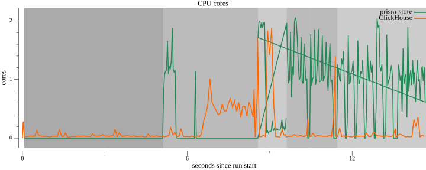
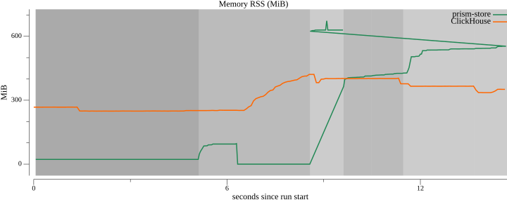
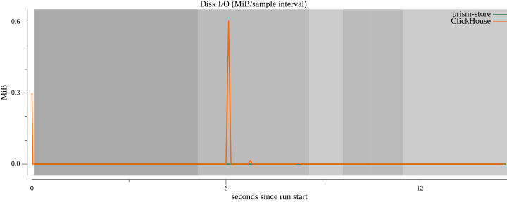

# Arrow transport profile (RBAC on)

Measured on this host with `make bench-api-arrow` — store queries over the RBAC-guarded HTTP SQL API with **Arrow IPC** transport for count/aggregation and a JSON-vs-Arrow scan comparison.

*prism-store count/aggregation use Arrow transport (`Accept: application/vnd.apache.arrow.stream`); scan phases compare JSON vs Arrow on the same SQL. ClickHouse uses its native protocol client; logs LIKE remains engine-level (no logs API). JWT/RBAC overhead applies to every store HTTP request.*

## Environment

| Key | Value |
|-----|-------|
| OS / arch | darwin / arm64 |
| CPU | Apple M1 Pro |
| RAM | 16.0 GiB |
| ClickHouse | 24.8.14.39 |
| DuckDB | v1.4.1 |
| Dataset | 1000000 metrics + 1000000 logs rows (scale=1) |
| Resource cap (per system) | 2 vCPU / 1024 MiB RAM |
| DuckDB threads / memory_limit | 2 / 1024MB |
| Idle baseline window | 5.0 s before workloads |
| Git commit | `970b95e` |
| Measured | 2026-07-23T17:37:11Z |

## Correctness gates

Metrics `COUNT(*)` over the full ingested table: store **1,000,000**, ClickHouse **1,000,000** (must match; equals dataset metrics row count).

Logs `LIKE '%deadline exceeded%'` count: store **10,000**, ClickHouse **10,000** (must match).

## Results (p50 / p95 / min ms; ingest: wall + rows/s)

| Workload | prism-store (Arrow) | ClickHouse |
|----------|---------------------|------------|
| ingest | 1.16s · 1719589 rows/s | 1.90s · 1051625 rows/s |
| count | 124.6 / 126.0 / 122.5 | 1.3 / 2.3 / 1.0 |
| aggregation | 137.7 / 139.0 / 135.0 | 9.8 / 29.3 / 8.9 |
| logs LIKE | 43.9 / 46.7 / 42.9 | 34.3 / 74.0 / 34.0 |

**Scan transport comparison** (same SQL, store only — not vs ClickHouse):

| Transport | p50 / p95 / min (ms) | rows returned |
|-----------|----------------------|---------------|
| JSON | 350.1 / 359.7 / 347.0 | 100,000 |
| Arrow | 172.9 / 173.9 / 161.0 | 100,000 |

## Resource usage (dense series; per-phase aggregates)

| Workload | System | CPU mean / peak (cores) | Peak RSS (MiB) | Read+write (MiB) | MiB/s | IOPS |
|----------|--------|-------------------------|----------------|------------------|-------|------|
| idle (baseline) | prism-store | 0.00 / 0.00 | 22.3 | n/a | n/a | n/a |
| idle (baseline) | ClickHouse | 0.04 / 0.15 | 267.9 | n/a | n/a | n/a |
| ingest | prism-store | 0.17 / 1.88 | 96.5 | n/a | n/a | n/a |
| ingest | ClickHouse | 0.36 / 1.72 | 421.5 | 0.6 | 0.2 | 0 |
| count | prism-store | 1.14 / 2.06 | 413.7 | n/a | n/a | n/a |
| count | ClickHouse | 0.06 / 0.33 | 402.8 | n/a | n/a | n/a |
| aggregation | prism-store | 0.98 / 1.86 | 426.1 | n/a | n/a | n/a |
| aggregation | ClickHouse | 0.16 / 1.39 | 403.4 | n/a | n/a | n/a |
| logs LIKE | prism-store | 0.64 / 1.99 | 672.9 | n/a | n/a | n/a |
| logs LIKE | ClickHouse | 0.41 / 1.88 | 421.4 | n/a | n/a | n/a |
| scan (JSON transport) | prism-store | 0.83 / 2.04 | 541.3 | n/a | n/a | n/a |
| scan (Arrow transport) | prism-store | 1.03 / 1.90 | 553.4 | n/a | n/a | n/a |

**API-Arrow profile:** store **count**, **aggregation**, **scan_json**, and **scan_arrow** sample the `prism-store` binary (HTTP `/sql` with JWT/RBAC). Store **logs LIKE** samples the benchmark process (embedded engine; server stopped). Store **ingest** and **idle** sample the `prism-store` binary. ClickHouse samples the container cgroup via cumulative counter diffs (~75 ms). **Scan phases** isolate JSON-vs-Arrow transport memory/latency on the same build — not a ClickHouse comparison.

**Caveats:** JWT verification and RBAC policy checks run on every store HTTP request. Container I/O/IOPS on Docker Desktop (macOS/Windows) frequently report blkio as 0 — meaningful container I/O needs a native Linux Docker host.

## Resource charts

### cpu-cores



### memory-rss



### disk-io




## Interpretation

Both systems ingested the same seeded dataset with JWT auth on store ingest. Each query workload is warmed once before K=5 timed runs.

**Count and aggregation** use the **Arrow IPC** transport over HTTP `/sql` (lazy-view sandbox + streaming). Compare against the attached JSON `-api` profile (~280–300 ms, ~471–483 MiB peak RSS on the same host class) to see the combined lazy-view (#54) + Arrow transport (#55) impact.

**Scan JSON vs Arrow** runs the same `SELECT … LIMIT N` over both transports on one build — isolating transport memory/latency (JSON full-buffer vs Arrow streaming). This is **not** compared to ClickHouse.

- **ingest**: prism-store leads on ingest throughput (1719589 vs 1051625 rows/s).
- **count** (Arrow): ClickHouse p50 1.3 ms beats prism-store 124.6 ms.
- **aggregation** (Arrow): ClickHouse p50 9.8 ms beats prism-store 137.7 ms.
- **logs_like** (Arrow): ClickHouse p50 34.3 ms beats prism-store 43.9 ms.
- **scan**: JSON p50 350.1 ms (peak RSS 541.3 MiB) vs Arrow p50 172.9 ms (peak RSS 553.4 MiB).
## Reproduce

```bash
make bench-api-arrow        # default scale (2M rows total)
make bench-api-arrow BENCH_SCALE=2
```

See [`bench/README.md`](README.md) for prerequisites and cleanup.
