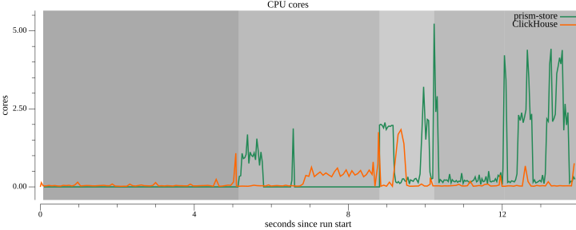
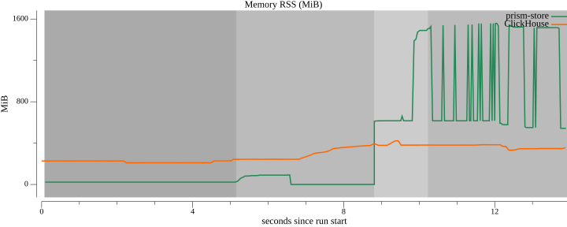
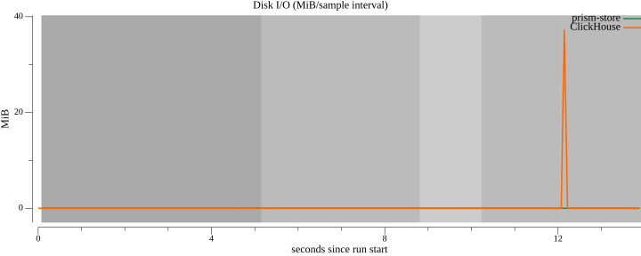

# Benchmark: prism-store (RBAC + HTTP `/sql`) vs ClickHouse

Measured on this host with `make bench-api` — queries over the RBAC-guarded HTTP SQL API.

*prism-store count/aggregation are end-to-end HTTP + JWT/RBAC + per-request sandbox (materialize-then-lock); ClickHouse uses its native protocol client; logs LIKE remains engine-level (no logs API).*

## Environment

| Key | Value |
|-----|-------|
| OS / arch | darwin / arm64 |
| CPU | Apple M1 Pro |
| RAM | 16.0 GiB |
| ClickHouse | 24.8.14.39 |
| DuckDB | v1.1.3 |
| Dataset | 1000000 metrics + 1000000 logs rows (scale=1) |
| Resource cap (per system) | 2 vCPU / 1024 MiB RAM |
| DuckDB threads / memory_limit | 2 / 1024MB |
| Idle baseline window | 5.0 s before workloads |
| Git commit | `3cedbda` |
| Measured | 2026-07-23T14:52:16Z |

## Correctness gates

Metrics `COUNT(*)` over the full ingested table: store **1,000,000**, ClickHouse **1,000,000** (must match; equals dataset metrics row count).

Logs `LIKE '%deadline exceeded%'` count: store **10,000**, ClickHouse **10,000** (must match).

## Results (p50 / p95 / min ms; ingest: wall + rows/s)

| Workload | prism-store | ClickHouse |
|----------|-------------|------------|
| ingest | 1.40s · 1431753 rows/s | 1.84s · 1084057 rows/s |
| count | 286.5 / 286.8 / 277.6 | 2.0 / 2.1 / 1.3 |
| aggregation | 296.9 / 300.8 / 291.3 | 10.6 / 25.3 / 8.7 |
| logs LIKE | 62.5 / 66.6 / 58.5 | 38.6 / 48.8 / 34.0 |

## Resource usage (dense series; per-phase aggregates)

| Workload | System | CPU mean / peak (cores) | Peak RSS (MiB) | Read+write (MiB) | MiB/s | IOPS |
|----------|--------|-------------------------|----------------|------------------|-------|------|
| idle (baseline) | prism-store | 0.00 / 0.00 | 22.7 | n/a | n/a | n/a |
| idle (baseline) | ClickHouse | 0.06 / 1.08 | 244.2 | 0.2 | 0.0 | 0 |
| ingest | prism-store | 0.18 / 1.87 | 92.3 | n/a | n/a | n/a |
| ingest | ClickHouse | 0.28 / 1.75 | 390.9 | 0.0 | 0.0 | 0 |
| count | prism-store | 1.19 / 2.26 | 471.2 | n/a | n/a | n/a |
| count | ClickHouse | 0.06 / 0.38 | 384.4 | n/a | n/a | n/a |
| aggregation | prism-store | 1.20 / 2.12 | 483.4 | n/a | n/a | n/a |
| aggregation | ClickHouse | 0.10 / 0.76 | 384.0 | 37.3 | 20.1 | 0 |
| logs LIKE | prism-store | 0.99 / 3.21 | 1490.0 | n/a | n/a | n/a |
| logs LIKE | ClickHouse | 0.34 / 1.84 | 422.7 | n/a | n/a | n/a |

**API profile:** store **count** and **aggregation** sample the `prism-store` binary (HTTP `/sql` with JWT/RBAC). Store **logs LIKE** samples the benchmark process (embedded engine; server stopped). Store **ingest** and **idle** sample the `prism-store` binary. ClickHouse samples the container cgroup via cumulative counter diffs (~75 ms).

## Resource charts

### cpu-cores



### memory-rss



### disk-io




## Interpretation

Both systems ingested the same seeded dataset. Each query workload is warmed once before K=5 timed runs.

**Metrics count and aggregation** scan the **full ingested metrics table** on both sides — no `ts` range predicate — so both systems read the same N rows (`SELECT count(*)` and `GROUP BY __name__` over every row). Rollup tiers are excluded on the store path to avoid double-counting.

**Logs LIKE** uses the same dataset-`ts` window on both systems (`ds.LogsQueryRange()`). The store path is **engine-level**: DuckDB `read_parquet` over a logs-shaped zstd Parquet tier in the store on-disk layout — the shipping store has no logs ingest API yet.

The store metrics path uses real HTTP Parquet ingest, hot→L0 flush, tier compaction, and a fixed-schema union over hot + tier Parquet (no rollups for these workloads).

ClickHouse uses MergeTree with `LowCardinality` dimensions, day partitioning, batched inserts (50k rows), and a `tokenbf_v1` skip index on `message`.

- **ingest**: prism-store leads on ingest throughput (1431753 vs 1084057 rows/s).
- **count**: ClickHouse p50 2.0 ms beats prism-store 286.5 ms on this host.
- **aggregation**: ClickHouse p50 10.6 ms beats prism-store 296.9 ms on this host.
- **logs_like**: ClickHouse p50 38.6 ms beats prism-store 62.5 ms on this host.
## Reproduce

```bash
make bench-api        # default scale (2M rows total)
make bench-api BENCH_SCALE=2
```

See [`bench/README.md`](README.md) for prerequisites and cleanup.
