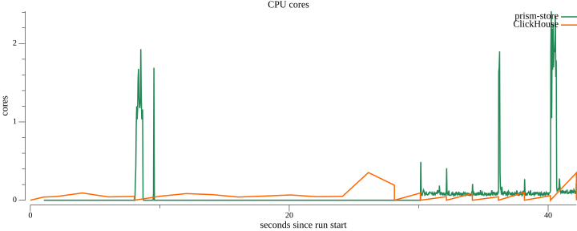
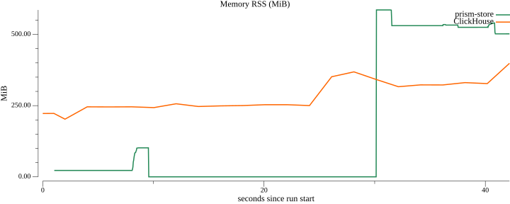
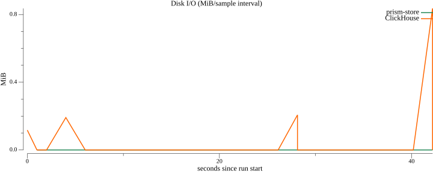

# Benchmark: prism-store vs ClickHouse

Measured on this host with `make bench` (default small profile).

## Environment

| Key | Value |
|-----|-------|
| OS / arch | darwin / arm64 |
| CPU | Apple M1 Pro |
| RAM | 16.0 GiB |
| ClickHouse | 24.8.14.39 |
| DuckDB | v1.1.3 |
| Dataset | 1000000 metrics + 1000000 logs rows (scale=1) |
| Resource cap (per system) | 2 vCPU / 1024 MiB RAM |
| DuckDB threads / memory_limit | 2 / 1024MB |
| Idle baseline window | 5.0 s before workloads |
| Git commit | `413d303` |
| Measured | 2026-07-23T10:33:05Z |

## Correctness gates

Metrics `COUNT(*)` over the full ingested table: store **1,000,000**, ClickHouse **1,000,000** (must match; equals dataset metrics row count).

Logs `LIKE '%deadline exceeded%'` count: store **10,000**, ClickHouse **10,000** (must match).

## Results (p50 / p95 / min ms; ingest: wall + rows/s)

| Workload | prism-store | ClickHouse |
|----------|-------------|------------|
| ingest | 1.52s · 1319232 rows/s | 2.05s · 974396 rows/s |
| count | 0.6 / 4.4 / 0.6 | 1.6 / 3.7 / 1.5 |
| aggregation | 13.3 / 15.0 / 12.5 | 11.1 / 36.3 / 9.6 |
| logs LIKE | 73.5 / 76.2 / 70.4 | 39.5 / 47.4 / 38.2 |

## Resource usage (dense series; per-phase aggregates)

| Workload | System | CPU mean / peak (cores) | Peak RSS (MiB) | Read+write (MiB) | MiB/s | IOPS |
|----------|--------|-------------------------|----------------|------------------|-------|------|
| idle (baseline) | prism-store | 0.00 / 0.00 | 22.3 | n/a | n/a | n/a |
| idle (baseline) | ClickHouse | 0.06 / 1.02 | 260.1 | 0.2 | 0.0 | 0 |
| ingest | prism-store | 0.04 / 1.67 | 90.3 | n/a | n/a | n/a |
| ingest | ClickHouse | 0.10 / 1.56 | 421.2 | 0.7 | 0.0 | 0 |
| count | prism-store | 0.36 / 1.02 | 633.0 | n/a | n/a | n/a |
| count | ClickHouse | 0.06 / 0.22 | 421.2 | n/a | n/a | n/a |
| aggregation | prism-store | 0.81 / 1.97 | 628.1 | n/a | n/a | n/a |
| aggregation | ClickHouse | 0.40 / 1.30 | 423.0 | 0.2 | 0.9 | 0 |
| logs LIKE | prism-store | 1.23 / 2.69 | 625.2 | n/a | n/a | n/a |
| logs LIKE | ClickHouse | 0.59 / 1.86 | 425.2 | n/a | n/a | n/a |

Store **count**, **aggregation**, and **logs LIKE** sample the benchmark process (embedded DuckDB engine). Store **ingest** and **idle** sample the `prism-store` binary. ClickHouse samples the container cgroup via cumulative counter diffs (~75 ms).

## Resource charts

### cpu-cores



### memory-rss



### disk-io




## Interpretation

Both systems ingested the same seeded dataset. Each query workload is warmed once before K=5 timed runs.

**Metrics count and aggregation** scan the **full ingested metrics table** on both sides — no `ts` range predicate — so both systems read the same N rows (`SELECT count(*)` and `GROUP BY __name__` over every row). Rollup tiers are excluded on the store path to avoid double-counting.

**Logs LIKE** uses the same dataset-`ts` window on both systems (`ds.LogsQueryRange()`). The store path is **engine-level**: DuckDB `read_parquet` over a logs-shaped zstd Parquet tier in the store on-disk layout — the shipping store has no logs ingest API yet.

The store metrics path uses real HTTP Parquet ingest, hot→L0 flush, tier compaction, and a fixed-schema union over hot + tier Parquet (no rollups for these workloads).

ClickHouse uses MergeTree with `LowCardinality` dimensions, day partitioning, batched inserts (50k rows), and a `tokenbf_v1` skip index on `message`.

- **ingest**: prism-store leads on ingest throughput (1319232 vs 974396 rows/s).
- **count**: prism-store p50 0.6 ms vs ClickHouse 1.6 ms.
- **aggregation**: ClickHouse p50 11.1 ms beats prism-store 13.3 ms on this host.
- **logs_like**: ClickHouse p50 39.5 ms beats prism-store 73.5 ms on this host.
## Reproduce

```bash
make bench        # default scale (2M rows total)
make bench BENCH_SCALE=2
```

See [`bench/README.md`](README.md) for prerequisites and cleanup.
